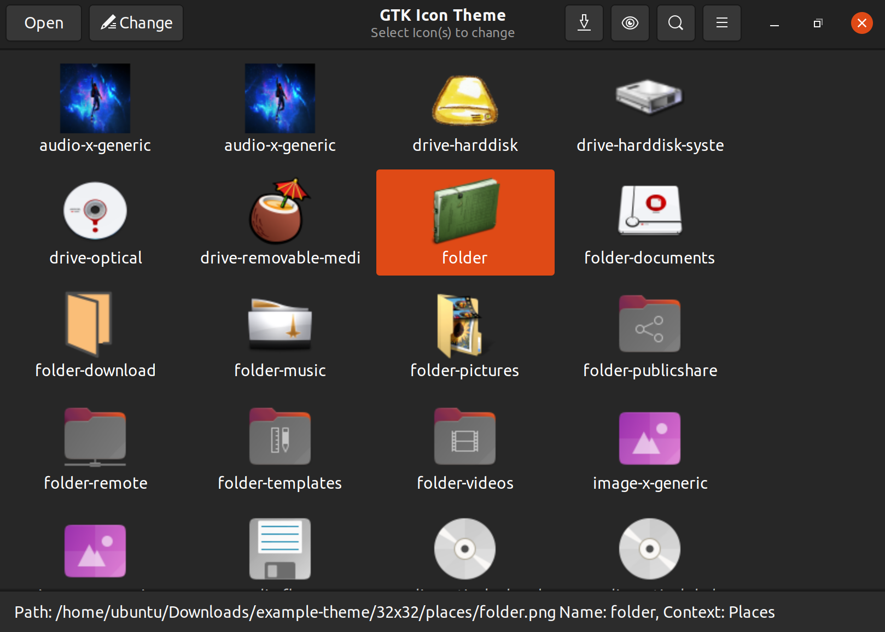
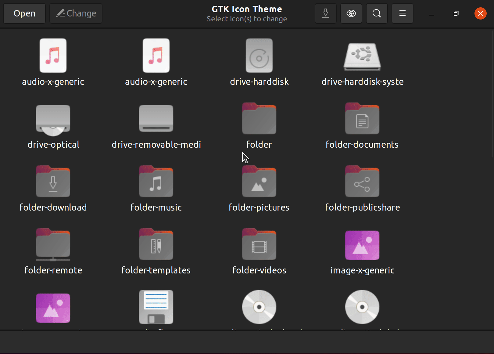
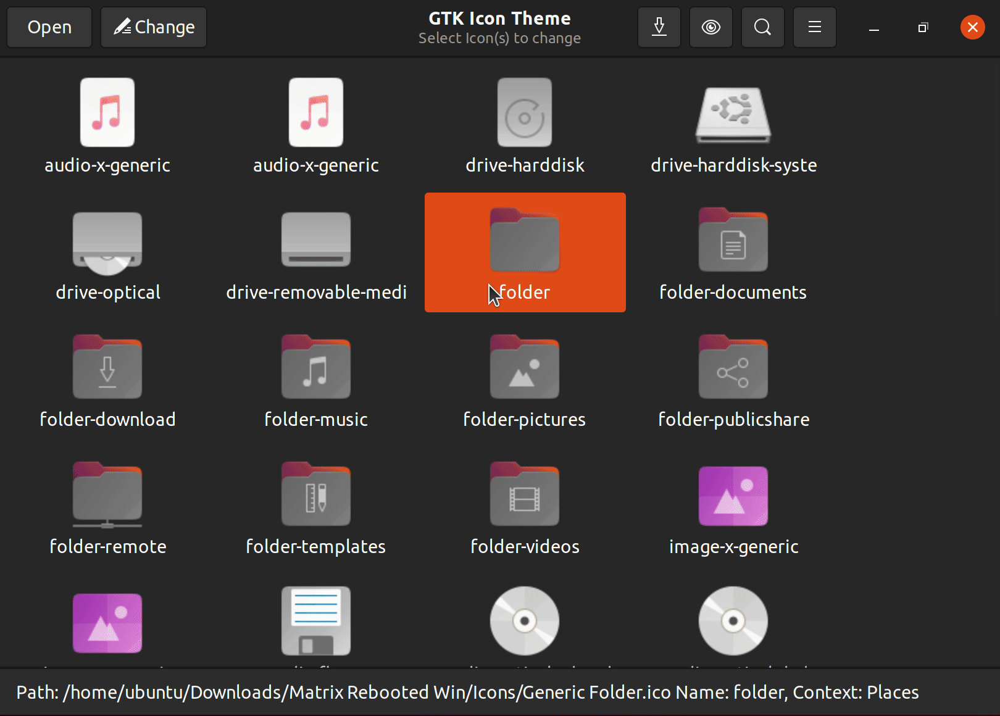
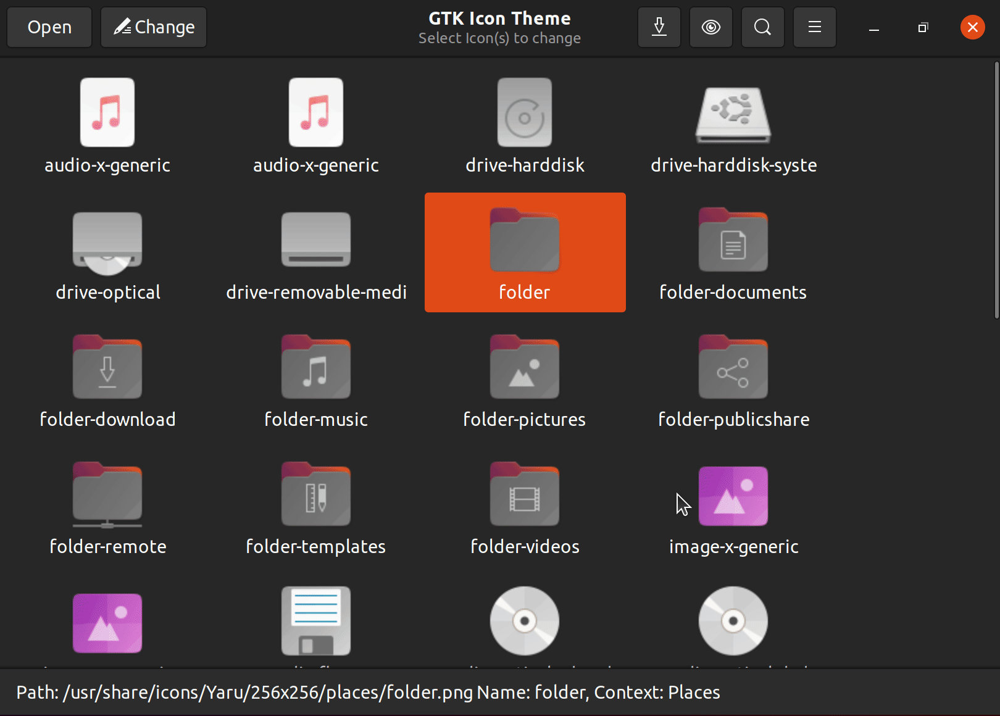
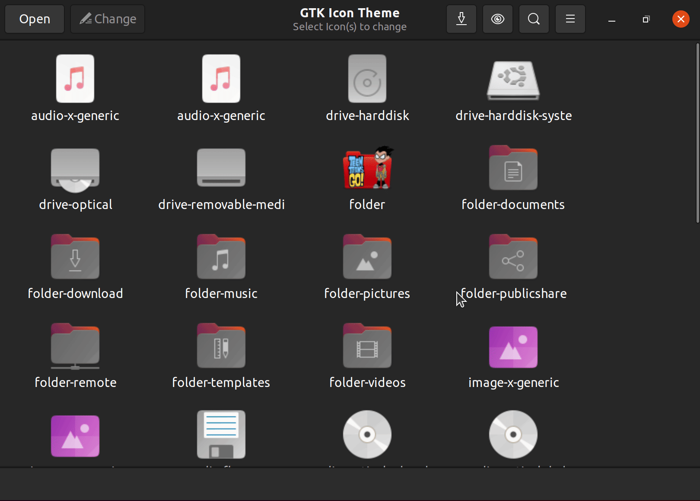
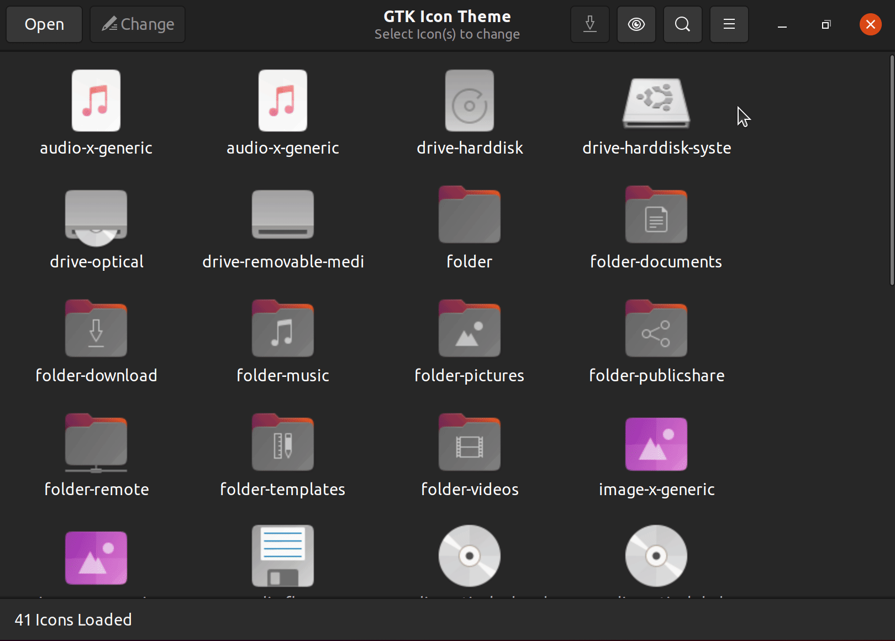

# Linux Icon Theme Builder



Making icon themes for Linux is a very manual effort. It requires making icons
of different sizes and placing them in specific folders. Typically themes are 
built by taking an existing theme and changing icons one at a time. 

At the same time, there isn't really an easy way in XFCE, Gnome, etc to make
custom themes. Often times folks who want to customize their icon themes don't
need to make an entire new theme, they just want to make a few changes
cosmetically to some of the icons in their dock. As it is today being able to
do that is not an easy task.

This application attempts to fill this gap. The key features of the application
are:

- Bulk icon changes
- Loading existing themes and making changes to them
- JPG/PNG image support
- Windows Resources
    - Icon files (ICO), extracts all resolutions
    - Icon libraries (ICL)
    - DLL/EXE files
- Change base theme
- Copy and pasting icons
- Supports any image size

Go from this:


To this:


in minutes!

## Installation and Running

Download this git repo and install the required python libraries:

```
$ pip3 install -r requirements.txt
```

then run

```
$ python3 icontheme.py
```

Multiple command line arguments exist, use `-h` to view them.

## Usage

Run `python3 icontheme.py` which will open the main window. The icons displayed
are from the current base icon theme. From here you can can select one (or more)
icon(s) and replace the icons. This base view is a preselected group of typical
icons. Clicking the eye icon allows you to select any icon context or select
**All** icons. 

To search for specific icons click the search button (or <kbd>Ctrl</kbd> + <kbd>f</kbd>)
and begin typing the search term. Click the search button or <kbd>ESC</kbd> to
close the search.

To replace icons you can either double click the icon, click the *Change*
button or right click and select *Change Icon*. From here you can select a
support file to select a replacement icon. The supported files are:

- Windows Icon (ICO)
- Windows DLL/EXE (both NE and PE files are supported)
- Windows Icon Libraries (ICL)
- PNG
- JPG

For PNG/JPG files the image will be squared up based on the smallest side then shrunk
to match the best fitting size up to 512 x 512.

You can also paste an image from the clipboard over any icon.

Changing icons doesn't change the current theme, this application makes new
icon themes based on a base theme. After making any changes you have to save
the changes and copy the new folder to `~/.icons`. 

You can edit a theme directly by clicking *Open* and opening an `index.theme`
file.

To change the base theme you open the menu, click *Base Theme* and select from
any of the installed themes.

If you haven't opened a theme (or are using the *Save As* menu) you will be asked
to save to a folder. A new folder will be created based on the name of the theme.
You can change the name and comment of the theme using the the settings menu
and selecting *Theme Options*. 

To remove any changes and reset back to the base them, select the icon(s) and press
the <kbd>DEL</kbd> key.

## Examples

#### Replace an Icon with a Windows ICO file



#### Replace an Icon with a Windows ICL icon



#### Replace an Icon with a Windows DLL icon


#### Replace an Icon with a pasted image



#### Replace an Icon with a PNG file



#### Change context, search and change multiple icons


#### Change the base theme



#### Change theme options


#### Open an existing theme


